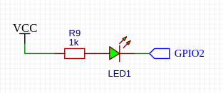

## shWiFiConfig - библиотека для настройки параметров WiFi-подключения для esp8266 и esp32

Библиотека предназначена для настройки параметров WiFi-соединения и поддержания связи. 

- [Основные возможности](#основные-возможности)
- [История версий](#история-версий)
- [Работа с библиотекой](#работа-с-библиотекой)
- [Остальные методы, не связанные с настройками модуля](#остальные-методы-не-связанные-с-настройками-модуля)
- [Настройки модуля](#настройки-модуля)
  - [Программные настройки](#программные-настройки)
  - [Прочие настройки](#прочие-настройки)
    - [Первая вкладка Web-интерфейса - **Режим STA**](#первая-вкладка-web-интерфейса---режим-sta)
    - [Вторая вкладка Web-интерфейса - **Режим AP**](#вторая-вкладка-web-интерфейса---режим-ap)
    - [Третья (опциональная) вкладка - **Режим Ap+STA**](#третья-опциональная-вкладка---режим-apsta)
    - [Четвертая вкладка - **Разное**](#четвертая-вкладка---разное)
- [Индикаторный светодиод](#индикаторный-светодиод)
- [Шифрование](#шифрование)
- [Зависимости](#зависимости)
- [Аддоны для ESP8266 и ESP32](#аддоны-для-esp8266-и-esp32)
  - [ESP8266](#esp8266)
  - [ESP32](#esp32)


### Основные возможности
- наличие Web-интерфейса;
- гибкая настройка параметров соединения как в режиме клиента, так и в режиме точки доступа;
- сохранение настроек в файловой системе модуля или в `EEPROM`;
- возможность шифрования паролей при сохранении;
- возможность использования комбинированного режима - одновременная работа модуля в качестве клиента и точки доступа;
- возможность защиты доступа к настройкам с помощью пароля администратора;
- возможность использования светодиода для индикации режима работы модуля;
- постоянное отслеживание наличия соединения, переход в режим точки доступа при нарушении связи, восстановление подключения, как только вновь появляется заданная в настройках сеть;

### История версий
 Версия 1.2 - 23.10.2024
* файлы исходников перемещены в папку `src`;
+ добавлена возможность сохранения конфигурации в `EEPROM`;
+ добавлена возможность шифрования паролей при сохранении;
+ добавлен метод `setCryptState(bool _state, String _crypt_key = "")`, позволяющий включать/отключать шифрование паролей при сохранении и задавать ключ шифрования;
* внесены изменения в примеры для демонстрации изменений;
* мелкие изменения и исправления;

 Версия 1.1 - 18.09.2024
+ добавлен метод saveConfig() - сохранение настроек в файл;
+ добавлена документация методов библиотеки;
+ добавлена возможность вывода сообщений в заданный HardwareSerial, например, Serial1;
+ ~~добавлена поддержка использования вывода отладочных сообщений через **USB CDC** (**STM32C3**, **STM32S3** и т.д.);~~
* исправлена работа индикаторного светодиода на **ESP32** с ядром 3.0 и выше;
+ добавлена возможность настройки яркости индикаторного светодиода;
* обработка событий сервера перенесена в метод `tick()`, теперь вызывать `HTTP.handleClient();` в `loop()` не нужно;
* примеры приведены в соответствие с изменениями библиотеки;
* теперь вывод отладочных сообщений возможен в любой поток, наследующий класс **Print**, будь то **Serial**, **File**, **LCD**, и т.д.;
* мелкие изменения и исправления; 

 Версия 1.0 - 13.08.2023
+ первая публикация библиотеки;

### Работа с библиотекой

Для начала работы нужно объявить экземпляр конфига. Сделать это можно двумя способами:

```
shWiFiConfig wifi_config;
```
или
```
shWiFiConfig wifi_config("admin", "password");
```
где
- `admin` - логин администратора;
- `password` - пароль администратора для доступа к Web-интерфейсу настроек;

Затем нужно инициировать конфиг:
```
wifi_config.begin(&HTTP, &FILESYSTEM);
```
где
- `HTTP` - ссылка на экземпляр Web-сервера (`ESP8266WebServer` для **esp8266** или `WebServer` для **esp32**), с которым будет работать конфиг;
- `FILESYSTEM` - ссылка на экземпляр файловой системы модуля для сохранения файла с настройками;
- третий параметр можно не использовать - это адрес страницы Web-интерфейса модуля; по умолчанию используется адрес **/wifi_config**;

или вариант с сохранением конфигурации в `EEPROM`:
```
wifi_config.begin(&HTTP);
```
где
- `HTTP` - ссылка на экземпляр Web-сервера (`ESP8266WebServer` для **esp8266** или `WebServer` для **esp32**), с которым будет работать конфиг;
- второй параметр так же можно не использовать - это адрес страницы Web-интерфейса модуля; по умолчанию используется адрес **/wifi_config**;

Перед подключением к сети нужно восстановить сохраненные ранее настройки:
```
wifi_config.loadConfig();
```
Если файл с настройками не будет найден (например, при первом запуске модуля), конфиг будет использовать настройки по умолчанию, одновременно будет создан файл с настройками по умолчанию.

А затем нужно установить WiFi-соединение:
```
wifi_config.startWiFi();
```
Будет выполнен поиск сохраненной сети и попытка подключения к ней, в случае неудачи будет создана точка доступа.

Имя точки доступа по умолчанию - `WIFI_AP_`, пароль точки доступа по умолчанию - `12345678`.

Для отслеживания состояния подключения в `loop()` нужно поместить вызов метода `tick()`:
```
wifi_config.tick();
```
Проверка состояния подключения по умолчанию выполняется один раз в 30 секунд, интервал проверки можно настраивать.

При потере соединения, модуль включается в режиме точки доступа, но, как только заданная WiFi-сеть становится доступной, модуль автоматически подключается к ней.

### Остальные методы, не связанные с настройками модуля
```
void stopWiFi();
```
Отключение WiFi сети.

```
bool startSoftAP();
bool startSoftAP(String ssid, String pass);
```
Создание точки доступа; первый вариант - создание точки доступа с сохраненными в настройках именем и паролем; второй вариант - создание точки доступа с произвольными данными.

```
bool startSTA();
bool startSTA(String ssid, String pass);
```
Подключение к WiFI-сети; первый вариант - подключение к сети, сохраненной в настройках; второй вариант - подключение к произвольной сети;

```
bool findSavedAp();
bool findAp(String ssid);
```
Поиск сети; первый вариант - поиск сохраненной в настройках сети; второй вариант - поиск произвольной сети;

```
void checkStaConnection();
```
Запуск процедуры немедленной проверки состояния подключения.

### Настройки модуля

#### Программные настройки

```
void setConfigFileName(String file_name)
String getConfigFileName();
```
установка файла для сохранения настроек WiFi; по умолчанию настройки сохраняются в файле **/wifi.json**; второй метод - соответственно, получение имени файла с настройками.

```
bool loadConfig();
bool saveConfig();
```
Загрузка сохраненных настроек из файла и, соответственно, сохранение настроек в файл.

Большая часть настроек доступна через Web-интерфейс модуля. Исключительно программно устанавливаются только следующие настройки:

```
void setCheckTimer(uint32_t _timer);
uint32_t getCheckTimer();
```
установка интервала проверки состояния подключения (в милисекундах); интервал по умолчанию - 30 секунд; второй метод - соответственно, получение текущего интервала;

```
void setLogOnState(bool log_on, HardwareSerial *_serial = &Serial);
bool getLogOnState();
```
включение/отключение выдачи сообщений о работе модуля через `Serial`; есть возможность задать другой поток для вывода сообщений, например, Serial1, если тот доступен; второй метод - соответственно, получение текущего состояния опции;

```
setCryptState(bool _state, String _crypt_key = "");
```
включение/отключение шифрования паролей при сохранении; параметр `_crypt_key` позволяет задать ключ для шифрования паролей; если оставить его пустым, или длина задаваемого ключа окажется меньше 10 символов, будет использоваться ключ по умолчанию (64 бит);

***ВАЖНО!!!** - если вы поменяете пароль, уже зашифрованные другим ключом данные могут быть потеряны*

```
void setUseComboMode(bool mode_on);
bool getUseComboMode();
```
включение/выключение возможности использования комбинированного режима; при включении этой опции в Web-интерфейсе модуля появляется дополнительная вкладка (**Режим AP+STA**), в которой можно управлять комбинированным режимом; второй метод - соответственно, получение текущего состояния опции; 

```
void setUseLed(bool _use, int8_t _pin = -1);
bool getUseLed();
```
включение/выключение возможности индикации режимов работы модуля с помощью светодиодного индикатора; при включении этой опции (`_use = true`) и заданном пине для подключения светодиода (`_pin >= 0`) на вкладке **Разное** Web-интерфейса модуля появляется чек-бокс **"Использовать индикаторный светодиод"**, позволяющий управлять использованием светодиода; второй метод - соответственно, получение текущего состояния опции; 

- `_pin` - пин, к которому подключается светодиод; управляется светодиод низким уровнем, т.е. подключать его следует катодом к пину (естественно, через ограничительный светодиод);

Если опция `setUseLed` включена, и задан пин светодиода, то индикация осуществляется следующим образом:
  
- быстрое мигание (пять раз в секунду) - поиск сети или подключение к ней; этот режим используется вне зависимости от состояния чек-бокса **"Использовать индикаторный светодиод"**;
- мигание с интервалом в одну секунду - работа в режиме точки доступа;
- плавное разгорание и затухание светодиода - модуль подключен к WiFi-сети и работает в качестве клиента; в комбинированном режиме используется такая же индикация;

```
void setLedPwmLevels(int16_t _max, int16_t _min);
```
установка значения ШИМ для максимальной и минимальной яркости индикаторного светодиода; `_max` - максимальное значение, `_min` - минимальное значение; т.к. светодиод подключается в [обратной полярности](#индикаторный-светодиод) (катодом к пину, анодом к **VCC**), максимальной яркости светодиода будет соответствовать минимальное значение ШИМ; значения можно задавать в пределах 0..1023.

#### Прочие настройки

Остальные настройки доступны через Web-интерфейс модуля. Доступ интерфейса по умолчанию осуществляется по адресу
```
 http://your_ip/wifi_config
```
 где **your_ip** - IP-адрес модуля.

 Здесь будут описаны методы, дублирующие соответствующие поля Web-интерфейса.


##### Первая вкладка Web-интерфейса - **Режим STA**

```
void setStaSsid(String sta_ssid);
void setStaPass(String sta_pass);
void setStaSsidData(String ssid, String pass);
```
Установка имени и пароля WiFi-сети. 

```
String getStaSsid();
String getStaPass();
```
соответственно, получение сохраненных имени и пароля сети.

- Если оставить эти поля пустыми, модуль всегда будет включаться в режиме точки доступа.

```
void setStaticIpMode(bool static_ip);
```
Включение/выключение опции **Назначить IP вручную**.

```
void getStaticIpMode(bool static_ip);
```
соответственно, получение данных о состоянии опции.

```
void setStaIP(IPAddress sta_ip);
void setStaGateway(IPAddress sta_gateway);
void setStaMask(IPAddress sta_mask);
```
Установка статических IP-адреса модуля, адреса шлюза и маски сети.

```
void setStaConfig();
void setStaConfig(IPAddress ip, IPAddress gateway, IPAddress mask);
```
То же самое, но одной строкой; первый метод - с использованием сохраненных в настройках параметров, второй - с использованием произвольных параметров.

```
IPAddress getStaIP();
IPAddress getStaGateway();
IPAddress getStaMask();
```

соответственно, получение сохраненных в настройках данных.

##### Вторая вкладка Web-интерфейса - **Режим AP**

```
void setApSsid(String ap_ssid);
void setApPass(String ap_pass);
void setApSsidData(String ssid, String pass);
```
Установка имени и пароля точки доступа, создаваемой модулем.

```
String getApSsid();
String getApPass();
```
соответственно, получение сохраненных в настройках данных.

```
void setApIP(IPAddress ap_ip);
void setApGateway(IPAddress ap_gateway);
void setApMask(IPAddress ap_mask);
```
 Установка IP-адреса, адреса шлюза и маски сети точки доступа.

 ```
void setApConfig();
void setApConfig(IPAddress ip);
void setApConfig(IPAddress ip, IPAddress gateway, IPAddress mask);
```
То же самое, но одним методом.
- первый метод - установка параметров, сохраненных в настройках;
- второй метод - установка произвольного IP-адреса и адреса шлюза; маска сети в этом случае устанавливается **255.255.255.0**;
- третий метод - установка произвольных данных;

##### Третья (опциональная) вкладка - **Режим Ap+STA**

Вкладка доступна при включенной опции `void setUseComboMode(bool mode_on)`.

```
void setApStaMode(bool mode_on);
```
Включение/выключение комбинированного режима.

```
bool getApStaMode();
```
соответственно, получение сохраненного в настройках значения опции.

##### Четвертая вкладка - **Разное**

```
void setUseAdminPass(bool pass_on);
```
Включение/выключение оции **Доступ к настройкам по паролю**; 

```
bool getUseAdminPass()
```
соответственно, получение сохраненного в настройках значения опции.

```
void setAdminData(String name, String pass);
```
Установка имени и пароля администратора для доступа к настройкам модуля. Имя по умолчанию - `admin`, пароль по умолчанию - `admin`.

```
String getAdminPass();
String getAdminName();
```
соответственно, получение сохраненных в настройках имени и пароля администратора.

```
void setLedOnMode(bool mode_on);
```
Включение/выключение опции **Использовать индикаторный светодиод**

```
bool getLedOnMode()
```
соответственно, получение сохраненного в настройках значения опции.


### Индикаторный светодиод

Если планируется использовать внешний светодиод, его следует подключать так же, как подключены штатные светодиоды - анодом через токоограничивающий резистор к **VCC**, катодом к соответствующему пину. Т.е. зажигается светодиод низким уровнем на пине



поэтому при минимальном значении ШИМ будет максимальный уровень яркости светодиода и наоборот.


### Шифрование

Используется для шифрования паролей при сохранении. Особенно актуально при сохранении параметров в файловой системе модуля.

Шифруются: имя и пароль точки доступа, пароль заданной WiFi-сети, логин и пароль администратора для доступа к Web-интерфейсу модуля.

Шифрование применяется как при сохранении параметров в файловой системе, так и при сохранении в `EEPROM`.

По умолчанию используется 64-битный ключ шифрования. Для шифрования разных параметров используются разные участки ключа.


### Зависимости

Для работы модулей требуется одна сторонняя библиотека:

- [ArduinoJson.h](https://github.com/bblanchon/ArduinoJson) - работа с данными в формате JSON (код писался с использованием версии 6.21.3, ниже версии 6.0 библиотека скорее всего не будет работать, с версиями 7.0 и выше работа не тестировалась);


### Аддоны для ESP8266 и ESP32

Инструкцию по установке аддонов смотри в документации к **Arduino IDE.**

#### ESP8266

Для работы с **ESP8266** используется аддон **esp8266 by ESP8266 Community**, ссылка для установки:
- http://arduino.esp8266.com/stable/package_esp8266com_index.json

Если не знаете, какую плату выбрать, выбирайте **NodeMCU 1.0 (ESP-12E Module)**.

#### ESP32

Для работы с **ESP32** используется аддон **esp32 by Espressif Systems**, ссылка для установки:
- https://dl.espressif.com/dl/package_esp32_index.json

Если не знаете, какую плату выбрать, выбирайте **ESP32 Dev Module** (или **ESP32C3 Dev Module**, **ESP32S3 Dev Module**, **ESP32S2 Dev Module** - в зависимости от того, какой процессор используется на вашей плате).

*Для работы с МК **ESP32C2**, **ESP32C6**, **ESP32H2** требуется версия аддона не ниже **3.0**.*

<hr>

Если возникнут вопросы, пишите на valesh-soft@yandex.ru 
